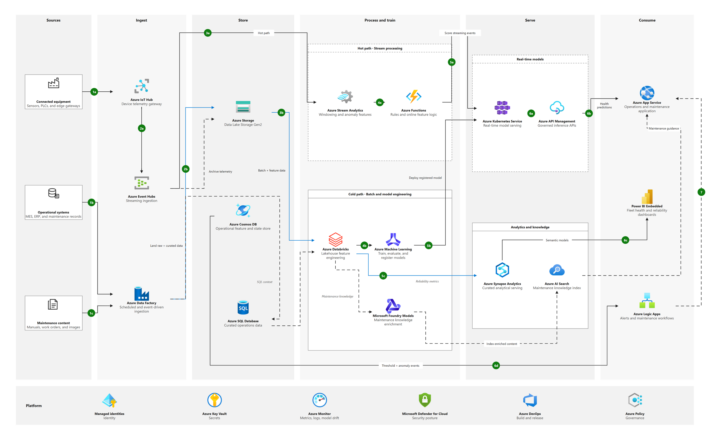
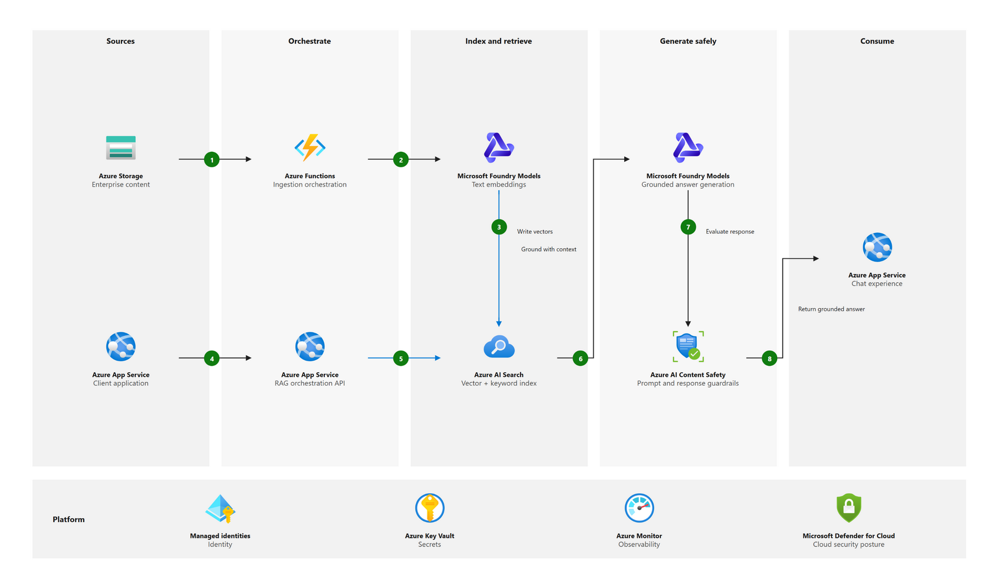
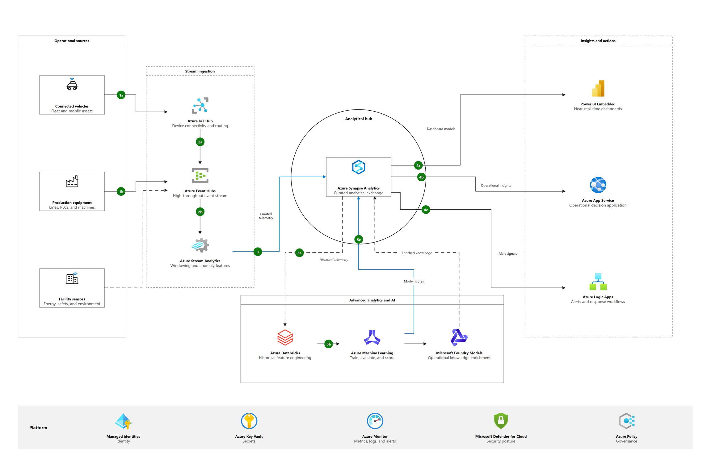
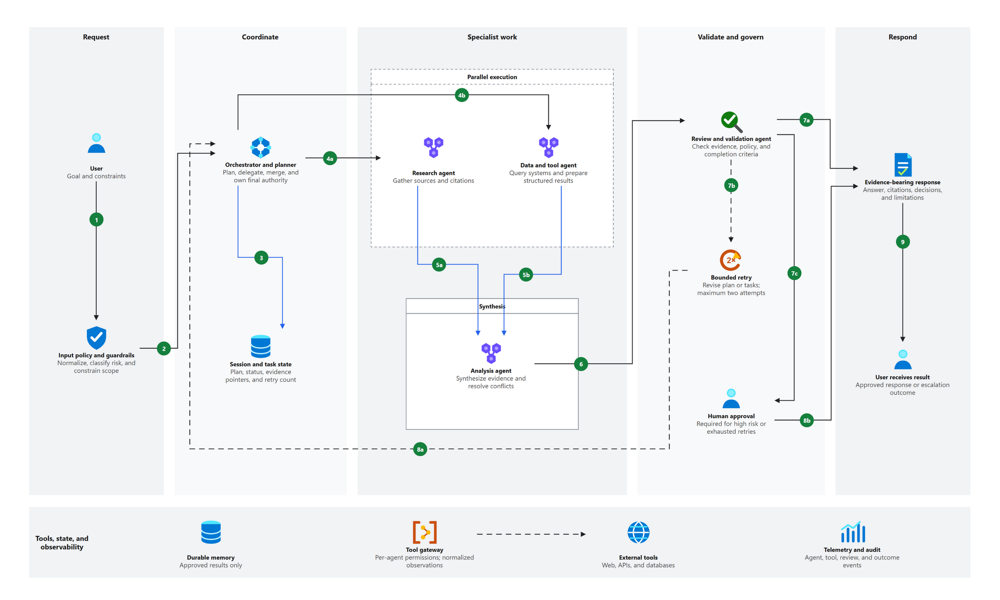

<div align="center">

# NexCanvas Draw.io

### A portable AI agent skill and diagramming toolkit for polished, editable, reference-grade technical diagrams

[](LICENSE)
[](https://www.python.org/)
[](https://www.drawio.com/)
[](SKILL.md)

Turn repositories, technical briefs, screenshots, and architecture references
into native Draw.io diagrams with reproducible contracts, verified assets,
content-driven layout selection, and rendered visual QA.

</div>



## Why NexCanvas exists

Most diagram automation stops when XML is valid. NexCanvas treats that as the
beginning, not the finish line. It addresses four recurring failures in
agent-generated architecture diagrams:

- unsupported architecture invented from an incomplete prompt;
- every problem forced into the same columns or generic card grid;
- logos that disappear after cloning or silently represent the wrong product;
- connectors, labels, badges, icons, and boundaries that collide in the final render.

The result is an editable `.drawio` artifact backed by evidence, semantic models,
local assets, machine-readable QA reports, and an inspected preview.

## Showcase

| Compact phase architecture | Hub-and-spoke analytical architecture |
|---|---|
| [](examples/v2-rag-reference/artifacts/diagram.drawio.png) | [](examples/v4-hub-spoke-industrial/artifacts/diagram.drawio.png) |
| Sparse five-phase RAG flow with platform foundation | Central analytical hub, source and consumer towers, and a lower AI enrichment zone |

The [dense 27-node reference](examples/v3-dense-industrial-ai),
[compact RAG reference](examples/v2-rag-reference), and
[hub-and-spoke reference](examples/v4-hub-spoke-industrial) are complete projects,
not flattened screenshots. Each includes source/model/lock contracts, local SVG
assets, editable Draw.io XML, a PNG with embedded diagram data, and QA reports.

### Workflow reference

[](examples/v5-multi-agent-workflow/artifacts/diagram.drawio.png)

The [multi-agent workflow reference](examples/v5-multi-agent-workflow) demonstrates
the same Microsoft-inspired phase grammar for an executable process: coordinator
delegation, parallel specialist groups, bounded retry, human escalation, terminal
outcomes, and separate connector lanes. It is explicitly modeled as `workflow`, not
as a generic component inventory.

## What the skill does

| Capability | Behavior |
|---|---|
| Semantic intent | Infers architecture, workflow, sequence, data-flow, or lifecycle from the brief without forcing a type questionnaire |
| Evidence contract | Records confirmed facts, assumptions, exclusions, and source snapshots before drawing; repository facts can be pinned to Git origin, revision, blob, file, and line range |
| Technical routing | Selects from 9 diagram families and 48 profiles across software, cloud, data, security, delivery, product, and AI/ML |
| Layout brainstorming | Scores phase columns, dense columns, rows, compact pipelines, hub-and-spoke, and hybrid compositions before geometry is locked |
| Reference grammar | Supports provider-neutral and Microsoft/AWS/Google-style icon-led architecture diagrams |
| Asset portability | Verifies and hashes SVG sources, stores them locally, and embeds them into the Draw.io artifact |
| Native output | Produces inspectable, uncompressed mxGraph XML instead of pasting a bitmap onto a canvas |
| Collision QA | Rejects node, icon, label, step-badge, connector-lane, and visible boundary-outline collisions |
| Visual proof | Renders through Draw.io Desktop, requires human/agent image inspection, then seals hashes at postflight |

## Agent-guided intake

Describe the system or process and specify the diagram language. That is enough
to start; you do not need to choose a diagram category, style, or canvas.

For example: "Draw a multi-agent system with one coordinator and specialist agents.
Use English." The agent derives the structure, compares layouts, builds an editable
diagram, and inspects the rendered result. Unspecified conceptual roles are recorded
as assumptions. When documenting an existing system, the agent inspects its sources.

The agent asks only for missing language or a content ambiguity that would change
the meaning of the diagram. Explicit visual references and output preferences remain
active for later examples and revisions until changed. See the
[intake contract](references/intake-and-discovery.md).

### Five semantic views

The five intents describe the question being answered, not the appearance of the diagram:

| Intent | Answers |
|---|---|
| Architecture | What components exist, where are they, and what depends on what? |
| Workflow | What work happens from trigger to outcome, including branches and approvals? |
| Sequence | Who exchanges messages, in what order, for one bounded interaction? |
| Data flow | Where does data originate, transform, persist, and get consumed? |
| Lifecycle | Which states can one entity enter, and what triggers each transition? |

The agent derives this intent from the brief, then selects a specialized route such as C4, deployment, RAG, agent orchestration, CI/CD, ETL, or state machine. The selected visual grammar remains independent, so any compatible view can still use the Microsoft/reference treatment and remains editable in Draw.io. See [semantic intents and repository evidence](references/semantic-intents-and-repository-evidence.md).

## Where generated output goes

The default project location is deliberately outside the installed skill:

```text
<your-current-repository>/
└── nexcanvas-output/
    └── <project-slug>/
        ├── source_model.json
        ├── diagram_lock.json
        ├── diagram_model.json
        ├── assets/
        │   ├── asset_manifest.json
        │   └── icons/
        ├── artifacts/
        │   ├── diagram.drawio
        │   └── diagram.drawio.png
        └── reports/
            ├── runtime.json
            ├── repository_evidence.json
            ├── layout_brainstorm.json
            ├── build.json
            ├── diagram_qa.json
            ├── render.json
            ├── visual_qa.json
            └── postflight.json
```

`repository_evidence.json` is emitted only for repository-backed diagrams. Other
reports are produced as their corresponding build, render, and review stages run.

The tracked [`nexcanvas-output/README.md`](nexcanvas-output/README.md) makes this
location visible in a fresh clone, while generated contents stay ignored. An
explicit project path can still be supplied.

## Install as an Agent Skill

NexCanvas follows the open Agent Skills directory convention: keep this entire
repository together so `SKILL.md` can reach its scripts, references, schemas,
configuration, and assets.

| Host | Project-scoped installation | Invocation |
|---|---|---|
| OpenAI Codex | `.agents/skills/nexcanvas-drawio/` | Ask naturally or use `$nexcanvas-drawio` |
| GitHub Copilot | `.github/skills/nexcanvas-drawio/` | Ask Copilot to use `nexcanvas-drawio` |
| Claude Code | `.claude/skills/nexcanvas-drawio/` | Ask naturally or use `/nexcanvas-drawio` |

### OpenAI Codex

```bash
mkdir -p .agents/skills
git clone https://github.com/sunniie/nexcanvas-drawio.git .agents/skills/nexcanvas-drawio
```

Codex discovers repository skills from `.agents/skills`; user-scoped skills can
live under `$HOME/.agents/skills`. See the official
[Codex skills documentation](https://developers.openai.com/codex/skills).

### GitHub Copilot

```bash
mkdir -p .github/skills
git clone https://github.com/sunniie/nexcanvas-drawio.git .github/skills/nexcanvas-drawio
```

GitHub documents project skill locations including `.github/skills`,
`.claude/skills`, and `.agents/skills`, plus personal Copilot skill folders. See
[Adding agent skills to GitHub Copilot](https://docs.github.com/en/copilot/how-tos/copilot-on-github/customize-copilot/customize-cloud-agent/add-skills).

### Claude Code

```bash
mkdir -p .claude/skills
git clone https://github.com/sunniie/nexcanvas-drawio.git .claude/skills/nexcanvas-drawio
```

Claude Code discovers project skills under `.claude/skills` and personal skills
under `~/.claude/skills`. See
[Extend Claude with skills](https://code.claude.com/docs/en/slash-commands).

### Example prompts

```text
Use NexCanvas Draw.io to investigate this repository and create a deployment
architecture for engineering onboarding. Ask only for unresolved decisions.
```

```text
Recreate this Microsoft architecture reference as editable Draw.io. Preserve its
visual grammar, but derive the topology from my system description.
```

```text
Repair this .drawio: eliminate overlapping connector lanes and keep all labels
clear of icons, step badges, and container outlines. Render and verify it.
```

## Quick start from the command line

Requirements:

- Python 3.10 or newer for authoring and structural QA;
- Draw.io Desktop for deterministic PNG/SVG/PDF export and complete visual QA;
- network access only when an icon must be synced and is not already local.

Inspect runtime capabilities:

```bash
python scripts/doctor.py
```

Initialize from only a title, brief, and output language. The skill infers the semantic intent and a compatible default route:

```bash
python scripts/project.py init --name "Checkout request" --brief "Trace one checkout API request through payment and inventory" --language en
```

Or choose an explicit directory:

```bash
python scripts/project.py init docs/architecture --name "My architecture" --family software --profile c4-container
```

After completing the generated contracts, build and gate the artifact:

```bash
PROJECT=nexcanvas-output/checkout-request
python scripts/layout_brainstorm.py "$PROJECT/diagram_model.json" --output "$PROJECT/reports/layout_brainstorm.json"
python scripts/build_drawio.py "$PROJECT/diagram_model.json" -o "$PROJECT/artifacts/diagram.drawio" --project-root "$PROJECT" --proof "$PROJECT/reports/build.json"
python scripts/diagram_qa.py "$PROJECT/diagram_model.json" --drawio "$PROJECT/artifacts/diagram.drawio" --source-model "$PROJECT/source_model.json" --project-root "$PROJECT" --output "$PROJECT/reports/diagram_qa.json" --fail-on-warning
python scripts/render.py "$PROJECT/artifacts/diagram.drawio" -o "$PROJECT/artifacts/diagram.drawio.png" --report "$PROJECT/reports/render.json"
```

Inspect the PNG before recording approval:

```bash
python scripts/visual_qa.py "$PROJECT/artifacts/diagram.drawio.png" --expected-width 1600 --expected-height 900 --approve --reviewer "Your name" --notes "Inspected at target size and connector terminals at 200%" --output "$PROJECT/reports/visual_qa.json"
python scripts/postflight.py "$PROJECT" --output "$PROJECT/reports/postflight.json"
```

### Repository-backed diagrams

When the diagram must reflect a real codebase, capture the current Git identity before authoring facts:

```bash
python scripts/repo_evidence.py capture . --source-model "$PROJECT/source_model.json" --source-id repo-1
```

Add repo-relative file and line ranges to fact evidence, then verify the exact origin, full commit, optional blob hash, and range. Pass the repository root again to release QA and postflight so provenance is rechecked rather than trusted from an old report:

```bash
python scripts/repo_evidence.py verify "$PROJECT/source_model.json" --repo-root . --output "$PROJECT/reports/repository_evidence.json"
python scripts/diagram_qa.py "$PROJECT/diagram_model.json" --drawio "$PROJECT/artifacts/diagram.drawio" --source-model "$PROJECT/source_model.json" --project-root "$PROJECT" --repo-root . --output "$PROJECT/reports/diagram_qa.json" --fail-on-warning
python scripts/postflight.py "$PROJECT" --repo-root . --output "$PROJECT/reports/postflight.json"
```

This verifies the authored evidence. It does not claim to discover live infrastructure, infer unknown ownership, or prove runtime behavior.

PowerShell users can replace the first line with
`$Project = "nexcanvas-output/my-architecture"` and `$PROJECT` with `$Project`.

## Reliable icons and logos

Catalog assets are resolved before drawing:

```bash
python scripts/icon_catalog.py postgresql
python scripts/icon_sync.py nexcanvas-output/my-architecture postgresql
```

Azure reference projects can sync exact assets from Microsoft's official
Architecture Icons package:

```bash
python scripts/icon_sync.py nexcanvas-output/my-architecture azure-functions --provider microsoft-azure-official --accept-terms
python scripts/icon_sync.py nexcanvas-output/my-architecture azure-ai-search --provider microsoft-azure-official --accept-terms
```

AWS and Google Cloud projects accept an official provider ZIP through
`--source-archive`. The resolver checks SVG safety, records source/version/hash
and license metadata, copies the asset into the project, and embeds it in the
editable Draw.io XML. If no exact verified logo exists, the skill uses a neutral
semantic glyph or reports `NeedsManual`; it does not improvise a brand mark.

## Layout and visual grammar

NexCanvas does not equate “architecture diagram” with one template. It chooses
composition after the semantic model is stable:

- **phase columns** for short left-to-right pipelines;
- **dense phase columns** for parallel hot/cold paths and substantial lifecycle views;
- **phase rows** when vertical progression shortens routes;
- **compact pipeline** for a small number of strong stages;
- **hub-and-spoke** for a real analytical, integration, or control center;
- **hybrid grid** when a main flow needs subordinate feedback, governance, or topology.

Provider-reference mode uses restrained neutral zones, official icon-led
services, numbered handoffs, orthogonal routing, and a foundation band. See
[reference image patterns](references/reference-image-patterns.md),
[layout brainstorming](references/layout-brainstorming.md), and the
[enterprise reference style](references/enterprise-reference-style.md).

## Quality gates

A project is complete only when:

1. one dominant semantic intent is resolved and compatible with the specialized route;
2. source facts are confirmed or explicitly marked as assumptions, and repository ranges are revision-verified when present;
3. route/profile requirements and model references are valid;
4. requested assets are exact, local, embedded, and renderable;
5. connectors have explicit semantics, independent lanes, correct direction, and distinct service ports for independent fan-in/fan-out relationships;
6. labels do not overlap nodes, icons, badges, connector strokes, or visible boundary outlines;
7. incoming and outgoing edges cannot form an accidental visual relay through a service, and title/legend chrome matches the model;
8. automated QA has zero errors and zero actionable warnings;
9. the rendered image was traced end to end at delivery size and connector terminals were inspected enlarged;
10. postflight confirms that source, model, lock, render, and approval hashes still match.

When Draw.io Desktop is unavailable, the portable tier can still generate and
structurally validate editable `.drawio`, but visual approval remains pending.

## Repository structure

```text
SKILL.md                          portable agent instructions
agents/openai.yaml               optional Codex interface metadata
workflows/                       generate, repair, and reference-conversion flows
references/                      notation, intake, layout, asset, and QA contracts
config/                          route, theme, archetype, and provider registries
schemas/                         JSON contracts
scripts/nexcanvas/               reusable implementation package
scripts/*.py                     host-neutral command-line entry points
tests/                           unit and reference-project tests
examples/v2-rag-reference/       compact phase reference
examples/v3-dense-industrial-ai/ dense industrial AI reference
examples/v4-hub-spoke-industrial/ hub-and-spoke reference
examples/v5-multi-agent-workflow/ multi-agent orchestration workflow
nexcanvas-output/                documented default generated-output root
```

## Development and validation

```bash
python -m unittest discover -s tests -v
python scripts/test_drawio_qa.py -v
python scripts/doctor.py
```

The implementation uses the Python standard library for its core contract,
layout, build, and QA pipeline. This keeps the same skill usable by Codex,
GitHub Copilot, Claude Code, and other hosts that implement Agent Skills.

## License

Code and documentation are licensed under [MIT](LICENSE). Technology marks and
provider icon packs remain subject to their owners' licenses and trademark
policies; asset provenance is recorded in each project manifest.
